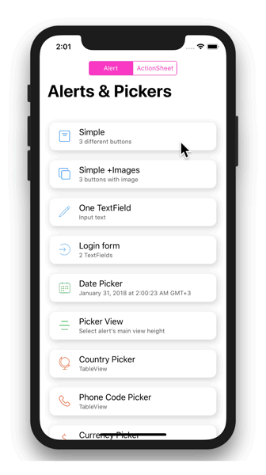
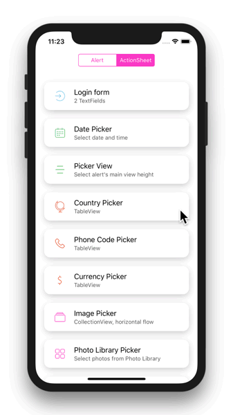
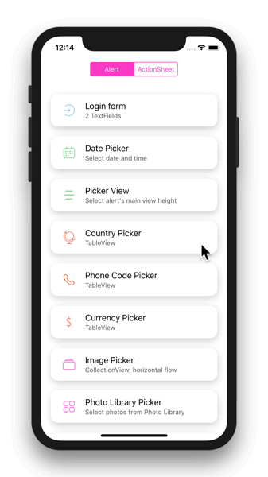
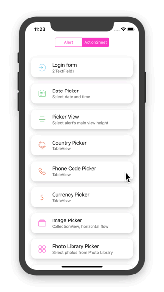
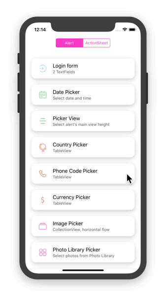
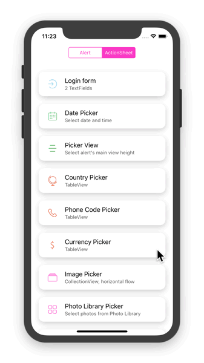
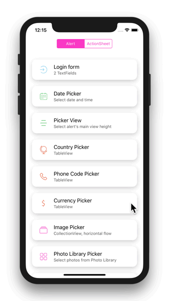

<div align = "center">

</div>


# Alerts & Pickers

Advanced usage of native UIAlertController with TextField, DatePicker, PickerView, TableView and CollectionView.


### Features

* Custom pickers based on UIDataPicker, UIPickerView, UITableView and UICollectionView.
* Easy contentViewController placement.
* Attributed title label and message label.
* Button customization: image and title color.
* Understandable action button placement.
* Easy presentation.
* Swift style.

<div align = "center">


</div>

## Usage

<div align = "center">


</div>

- New Alert

```swift
let alert = UIAlertController(style: .alert, title: "Title", message: "Message")
// or
let alert = UIAlertController(style: .alert)
```

- Set and styling title

```swift
alert.set(title: "Title", font: .systemFont(ofSize: 20), color: .black)
// or
alert.setTitle(font: .systemFont(ofSize: 20), color: .black)
```

- Set and styling message

```swift
alert.set(message: "Message", font: .systemFont(ofSize: 16), color: .black)
// or
alert.setMessage(font: .systemFont(ofSize: 16), color: .black)
```
- Add button with image

```swift
alert.addAction(image: image, title: "Title", color: .black, style: .default)
```

* Show Alert

```swift
// show alert
alert.show()

// or show alert with options
alert.show(animated: true, vibrate: true) {
  // do smth on completion
}
```
<div align = "center">


</div>


## Set Content ViewController

When setting your own custom `UIViewController` into `UIAlertController` keep in mind to set `prefferedContentSize.height` of the controller otherwise it will no effect. You can not set `prefferedContentSize.width`.

```swift
let alert = UIAlertController(style: .alert, title: "Title")
let vc = CustomViewController()
vc.preferredContentSize.height = height
alert.setValue(vc, forKey: "contentViewController")
alert.show()

// or
let alert = UIAlertController(style: .alert, title: "Title")
let vc = CustomViewController()
alert.set(vc: vc, height: height)
alert.show()
```

## Pickers
For UX better to use `.actionSheet` style in `UIAlertController` when set picker into `contentViewController`. If you like you can use `.alert` style as well, buy `.actionSheet` style is wider and User can see more as well as action button is placing at bottom that also more convenience for User to touch it.

**UITextField**
In native UIAlertController you can only add `UITextField` to `.alert` style with default style and you can not change such properties as `.borderColor`, `.borderWidth`, `.frame.size` and so on. But if you make your own `UIViewController` with `UITextField`, it will solve all these problems.

## One TextField Picker

You can use both styles `.alert` and `.actionSheet` of `UIAlertController`.

<div align = "center">


</div>

```swift
let alert = UIAlertController(style: self.alertStyle, title: "TextField")                  
let config: TextField.Config = { textField in
    textField.becomeFirstResponder()
    textField.textColor = .black
    textField.placeholder = "Type something"
    textField.left(image: image, color: .black)
    textField.leftViewPadding = 12
    textField.borderWidth = 1
    textField.cornerRadius = 8
    textField.borderColor = UIColor.lightGray.withAlphaComponent(0.5)
    textField.backgroundColor = nil
    textField.keyboardAppearance = .default
    textField.keyboardType = .default
    textField.isSecureTextEntry = true
    textField.returnKeyType = .done
    textField.action { textField in
        // validation and so on
    }
}              
alert.addOneTextField(configuration: config)
alert.addAction(title: "OK", style: .cancel)
alert.show()
```

## Two TextFields Picker

You can use both styles `.alert` and `.actionSheet` of `UIAlertController`.

<div align = "center">


</div>

```swift
let alert = UIAlertController(style: .alert, title: "Login")

let configOne: TextField.Config = { textField in
    textField.left(image: user), color: .black)
    textField.leftViewPadding = 16
    textField.leftTextPadding = 12
    textField.becomeFirstResponder()
    textField.backgroundColor = nil
    textField.textColor = .black
    textField.placeholder = "Name"
    textField.clearButtonMode = .whileEditing
    textField.keyboardAppearance = .default
    textField.keyboardType = .default
    textField.returnKeyType = .done
    textField.action { textField in
        // action with input
    }
}

let configTwo: TextField.Config = { textField in
    textField.textColor = .black
    textField.placeholder = "Password"
    textField.left(image: lock, color: .black)
    textField.leftViewPadding = 16
    textField.leftTextPadding = 12
    textField.borderWidth = 1
    textField.borderColor = UIColor.lightGray.withAlphaComponent(0.5)
    textField.backgroundColor = nil
    textField.clearsOnBeginEditing = true
    textField.keyboardAppearance = .default
    textField.keyboardType = .default
    textField.isSecureTextEntry = true
    textField.returnKeyType = .done
    textField.action { textField in
        // action with input
    }
}
// vInset - is top and bottom margin of two textFields   
alert.addTwoTextFields(vInset: 12, textFieldOne: configOne, textFieldTwo: configTwo)
alert.addAction(title: "OK", style: .cancel)
alert.show()
```

## DatePicker

`UIDatePicker` does not look very much in `.alert` style.

<div align = "center">


</div>

```swift
let alert = UIAlertController(style: .actionSheet, title: "Select date")
alert.addDatePicker(mode: .dateAndTime, date: date, minimumDate: minDate, maximumDate: maxDate) { date in
    // action with selected date
}
alert.addAction(title: "OK", style: .cancel)
alert.show()
```

## PickerView

Example how to use `UIPickerView` as `contentViewController` and change height of the `UIAlertController`.

<div align = "center">


</div>

```swift
let alert = UIAlertController(style: .actionSheet, title: "Picker View", message: "Preferred Content Height")

let frameSizes: [CGFloat] = (150...300).map { CGFloat($0) }
let pickerViewValues: [[String]] = [frameSizes.map { Int($0).description }]
let pickerViewSelectedValue: PickerViewViewController.Index = (column: 0, row: frameSizes.index(of: 216) ?? 0)

alert.addPickerView(values: pickerViewValues, initialSelection: pickerViewSelectedValue) { vc, picker, index, values in
    DispatchQueue.main.async {
        UIView.animate(withDuration: 1) {
            vc.preferredContentSize.height = frameSizes[index.row]
        }
    }
}
alert.addAction(title: "Done", style: .cancel)
alert.show()
```

## Locale Pickers

Is based on `UITableView` with `UIActivityIndicatorView`.

* #### Country Picker

<div align = "center">


</div>

```swift
let alert = UIAlertController(style: .actionSheet, message: "Select Country")
alert.addLocalePicker(type: .country) { info in
    // action with selected object
}
alert.addAction(title: "OK", style: .cancel)
alert.show()
```

* #### Phone Code Picker

<div align = "center">


</div>

```swift
let alert = UIAlertController(style: .actionSheet, title: "Phone Codes")
alert.addLocalePicker(type: .phoneCode) { info in
    // action with selected object
}
alert.addAction(title: "OK", style: .cancel)
alert.show()
```

* #### Currency Picker

<div align = "center">


</div>

```swift
let alert = UIAlertController(style: .actionSheet, title: "Currencies")
alert.addLocalePicker(type: .currency) { info in
    alert.title = info?.currencyCode
    alert.message = "is selected"
    // action with selected object
}
alert.addAction(title: "OK", style: .cancel)
alert.show()
```

## Image Pickers

Is based on `UICollectionView` with `UIActivityIndicatorView`.

* #### Horizontal Image Picker

<div align = "center">


</div>

```swift
let alert = UIAlertController(style: .actionSheet)
let photos: [UIImage] = images
alert.addImagePicker(
    flow: .horizontal,
    paging: true,
    images: photos,
    selection: .single(action: { [unowned self] image in
        // action with selected image
    }))
alert.addAction(title: "OK", style: .cancel)
alert.show()
```

* #### Vertical Image Picker

<div align = "center">


</div>

```swift
let alert = UIAlertController(style: .actionSheet)
let photos: [UIImage] = images
alert.addImagePicker(
    flow: .vertical,
    paging: false,
    height: UIScreen.main.bounds.height,
    images: photos,
    selection: .multiple(action: { [unowned self] images in
        // action with selected images
    }))
alert.addAction(title: "OK", style: .cancel)
alert.show()
```

## Alerts vs. Action Sheets

There are some things to keep in mind when using `.actionSheet` and `.alert` styles:

* Pickers better to use in `.actionSheet` style.
* `UITextField` can be used in both styles.

## Installing

#### Manually

Download and drop `/Extensions`, `/Pickers` and `/Views` folders in your project.

## Requirements

* Swift 4
* iOS 11 or higher

## Authors

* **Roman Volodko** -  [dillidon](https://github.com/dillidon)

## Communication

* If you **found a bug**, open an issue.
* If you **have a feature request**, open an issue.
* If you **want to contribute**, submit a pull request.

## License

This project is licensed under the MIT License.
